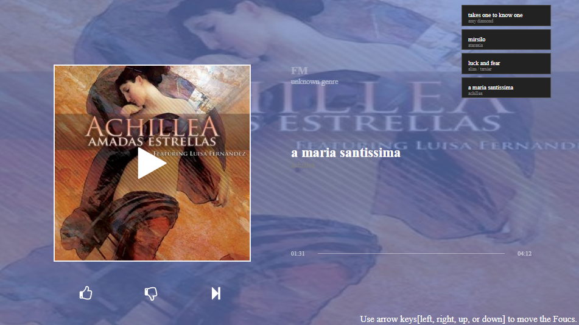

A Music Application based on React and Redux  

### Overview
It(music-app-based-on-react) is a sample of music player based on H5 Audio and react.js. It is created by the `react script`.

Its theme used TV design style. So it is fit to run in TV. As a web app, so you can also run it on PC or mobile using Chrome or Safari.

### App Snapshot



### Construct sketch  
__dependencies__  
- react  
- react-dom  
- react-icons  
- react-redux  
- redux  
- [react-tv](https://github.com/opennext/react-tv) (Key Navigation)   
  ...  

### How to run
Run:
```shell
yarn install
```
```
yarn run build
```
You will get the code in the dir: /build for production ENV.

__Or__ use `yarn run start` to develop it.
```
yarn run start
```